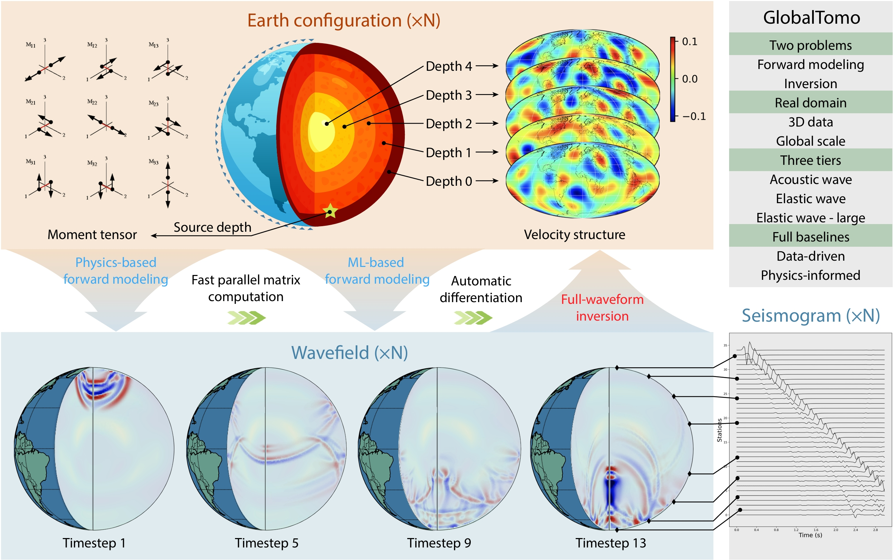

# GlobalTomo
The first global dataset for physics-ML seismic wavefield modeling and full-waveform inversion

<p align="left">
    <a href='https://lishiqianhugh.github.io/GlobalTomo/'>
    
    </a>
    <a href='https://forms.gle/wC1mLULDmoQYpugo8'>
    
    </a>
</p>



## Project structure
```
GlobalTomo/
│
├── conf/
│   ├── config.yaml      # Configuration file
│
├── images/              
│   └── overview.jpg
│
├── scripts/             
│   ├── eq.py            # Defination of PDE constraints
│   ├── load_data.py     # Dataloader from .h5 files
│   ├── meta_info.py     # Meta information about the data
│   ├── misc.py          # Custmized training tools
│   ├── model.py         # Custmized ML models
│   └── plot.py          # Visualization tools
│
├── .gitignore           # Contents ignored by git
├── index.html           # Website
├── infer.py             # Evaulation functions
├── inverse.py           # Inversion functions
├── LICENSE              # License
├── README.md            # An instruction for use
├── requirements.txt     # Dependencies
└── train.py             # Training script
```

## Getting started
```
conda create -n globaltomo python==3.8
conda activate globaltomo
pip install -r requirements.txt
```
## Download the data
To access the data, please click this <a href="https://forms.gle/wC1mLULDmoQYpugo8">link</a> and fill the request form.

