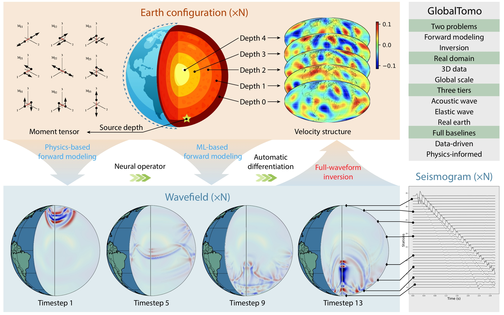

# GlobalTomo
The first global dataset for physics-ML seismic wavefield modeling and full-waveform inversion

<p align="left">
    <a href='https://global-tomo.github.io/'>
    
    </a>
    <a href='https://forms.gle/wC1mLULDmoQYpugo8'>
    
    </a>
    <a href='https://vimeo.com/957588046'>
      
    </a>
</p>



## Project structure
```
GlobalTomo/
│
├── conf/
│   ├── config.yaml      # Configuration file
│
├── images/              
│   └── overview.jpg
│
├── scripts/             
│   ├── eq.py            # Defination of PDE constraints
│   ├── load_data.py     # Dataloader from .h5 files
│   ├── meta_info.py     # Meta information about the data
│   ├── misc.py          # Custmized training tools
│   ├── model.py         # Custmized ML models
│   └── plot.py          # Visualization tools
│
├── .gitignore           # Contents ignored by git
├── infer.py             # Evaulation functions
├── inverse.py           # Inversion functions
├── LICENSE              # License
├── README.md            # An instruction for use
├── requirements.txt     # Dependencies
└── train.py             # Training script
```

## Getting started
```
conda create -n globaltomo python==3.8
conda activate globaltomo
pip install -r requirements.txt
```

## Training forward models
Define your training configuration files within the `conf` directory. For example configurations, refer to the YAML files in the repository. Typically, you should specify the data tier, model type, and desired output in these files. Ensure that the custom.name in your configuration matches the file name.

To initiate training, execute the following command:

```
python train.py --config-name='acoustic_wfslice_MLP'
```
Once training is complete, the checkpoints will be automatically stored in the `outputs` directory.

## Evaluating forward models
Before evaluating the trained models, specify the `wave_type`, `output_type`, and `model_name` in `infer.py`.

Then, run the following command to start evaluation. 
```
python infer.py
```
If the model path exists, the code will automatically load the configurations and the model parameters for evaluation.
## Inversion
### 1. Optimization-based inversion
To perform an inversion using the trained forward models, specify the model path in `inverse.py`. Then, execute the following command to begin optimizing the structure from a random starting point:
```
python inverse.py
```
### 2. Direct inverse mapping
An alternative strategy is to train a neural network that directly maps the observed seismogram to the velocity structure. To do this, create a config file with `custom.velocity` set to `true` and define other parameters as shown in the example file `conf/acoustic_velocity_MLP.yaml`. Use a command similar to the one used for training forward models:

```
python train.py --config-name='acoustic_velocity_MLP'
```
## Download the data
To access the data, please click this <a href="https://forms.gle/wC1mLULDmoQYpugo8">link</a> and fill the request form.

